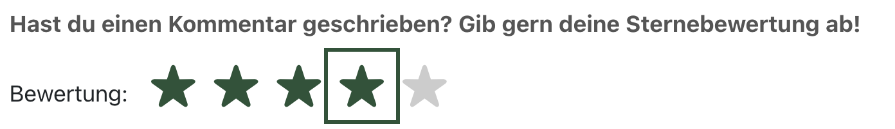

# TOP-BOB
### Die besten barrierefreien Orte Berlins!

TOP-BOB ist eine Webanwendung, die es Usern ermöglichen soll, sehr unkompliziert barrierefreie Orte, wie Restaurants, Bars, Parks, Museen etc., in Berlin zu finden oder weiterzuempfehlen.
User können eigene Empfehlungen eintragen oder vorhandene Einträge kommentieren. Das Besondere an TOP-BOB ist das tatsächliche Experten in Sachen Barrierefreiheit ihre Erfahrungen mit anderen teilen können und so eine Übersicht der besten barrierefreien Orte in Berlin entstehen kann.

## Projektbeschreibung
**TOP-BOB** ist im Rahmen des Moduls **Barierefreie Webentwicklung** im Studiengang Informatik und Wirtschaft an der HTW Berlin entstanden.   
Aufgabe war es ein beliebiges Web-Projekt zu erstellen mit 6 Erfolgskriterien aus den Web Content Accessibility Guidelines (WCAG) 2.2.
Zusätzlich zu den Erfolgskriterien sollte die Applikation folgendes beinhalten:
1. Verwenden von Semantischem  Markup
2. Projekt über Tastatur bedienbar
3. Sprache im Dokument angegeben
4. Fokus-ring bei jedem Element sichtbar
5. Skip-link vorhanden, um Bereiche zu überspringen   

selbstgewählte Kriterien:
- 1.1.1 Non-text Content
- 1.4.4 Resize Text
- 1.4.6 Contrast (Enhanced)
- 2.4.2 Page Titled
- 2.5.5 Target Size
- 3.3.3 Error Suggestion  

**Derzeit befindet sich das Projekt in der Entwicklungsphase und ist nocht nicht abgeschlossen.**   
Das Frontend ist bereits zu großen Teilen implementiert ist. Zukünftig sollen ein Backend und eine Datenbank integriert werden, um die Anwendung vollständig zu machen.

## Umsetzung der Kriterien zur Barrierefreiheit

#### **1. Verwenden von Semantischem  Markup**   

Um Zugänglichkeit für Screenreader und andere assistive Technologien auf die Anwendung zu gewährleisten, ist die Verwendung semantischen HTMLs wichtig.
- semantische HTML-Elemente wie `<header>`,  `<nav>`, `<main>`, `<section>`, `<form>` und `<footer>` wurden verwendet, um die Struktur der Seite klar zu definieren und den Inhalt sinnvoll zu gliedern.
- Überschriften  (`<h1>` - `<h6>`) wurden in der richtigen Hierarchie eingesetzt, um die Struktur der Inhalte deutlich zu machen.
- Formular-Elemente sind korrekt mit `<label>`-Tags verknüpft, um sicherzustellen, dass Screenreader die Formulareingabefelder korrekt vorlesen können.
  Es wurden aria-label- und aria-describedby-Attribute verwendet, um zusätzlichen Kontext bereitzustellen, falls nötig

#### **2. Projekt über Tastatur bedienbar**    

Logische Tab-Reihenfolge:

- Alle interaktiven Elemente (Formulare, Links, Buttons) sind in einer logischen Reihenfolge über die Tabulatortaste erreichbar. Dies ermöglicht eine intuitive Navigation durch die Benutzeroberfläche.

**---> Die Navigation mit der Tastatur, insbesondere bei den Formularen, funktioniert bisher noch nicht einwandfrei und muss noch verbessert werden**

#### **3. Sprache im Dokument angegeben**  

Screenreader nutzen die Spracheinstellungen, um den Text korrekt auszusprechen. Wenn die Sprache nicht angegeben ist, kann der Screenreader Schwierigkeiten haben, die Inhalte richtig zu interpretieren, was zu Missverständnissen führt.

- die Spracheinstellung wurde in der index.html vorgenommen : `<html lang="de">`

#### **4. Fokus-Ring bei jedem Element sichtbar**  

Ein Fokus-Ring hilft Menschen mit Sehbehinderungen oder solchen, die auf die Tastatur angewiesen sind, sich auf der Seite zurechtzufinden.

- Fokus-Ring wurde gesetzt und in einem einheitlichen (Design)Stil angelegt, um Verwirrung zu vermeiden.
  
  main.css: 
`:focus {
  outline: 3px solid #295338; 
  outline-offset: 2px; 
}`

#### **5. Skip-Link vorhanden, um Bereiche zu überspringen**  

Skip-Links ermöglichen es Nutzern von Screenreadern und Tastaturbenutzern, direkt zum Hauptinhalt der Seite zu springen, ohne durch alle Navigationslinks oder andere wiederholte Inhalte scrollen zu müssen.

 - Skip-Link wurde in App.vue gesetzt:   
  `<a href="#main-content" class="skip-link">Zum Hauptinhalt springen</a>`


#### **1.1.1 Non-text Content**

Für Bilder und Grafiken ist es wichtig, alternative Texte bereitzustellen, die den Inhalt und die Funktion des Bildes beschreiben. Dies ermöglicht es Nutzern von Screenreadern, die Informationen zu verstehen, die visuell nicht erkennbar sind.

 - für das Logo für ein alternativ Text gesetzt. Es sind sonst keine weiteren visuellen Inhalte auf der Website enthalten.

   ``

#### **1.4.4 Resize Text**  

Viele Nutzer, insbesondere ältere Menschen oder Personen mit Sehbehinderungen, benötigen größere Schriftarten, um Inhalte besser lesen zu können. Zudem hat ohnehin jeder Benutzer unterschiedliche Vorlieben und Bedürfnisse hinsichtlich der Textgröße. Flexibilität in der Textgröße ermöglicht es Nutzern, die Darstellung nach ihren Wünschen anzupassen.

- eine Funktion zum Vergrößern und Verkleinern des Textes wurde implementiert ohne dass die Darstellung der Inhalte dadurch beeinträchtigt wird. Die Textgröße ist bis zu 200% vergrößerbar. 


#### **1.4.6 Contrast (Enhanced)**  

Ein ausreichender Kontrast zwischen Text und Hintergrund erleichtert das Lesen von Inhalten. 
Personen mit Sehbehinderungen, einschließlich Farbblindheit oder eingeschränkter Sehschärfe, benötigen oft einen höheren Kontrast, um Informationen wahrzunehmen und zu verstehen. Ein guter Kontrast hilft, Inhalte für alle zugänglich zu machen.

 - alle eingesetzten Farben wurden auf ihren Kontrast hin geprüft und erfüllen die Anforderungen eines minimum Verhältnisses von 7:1

#### **2.4.2 Page Titled**  

Menschen, die Screenreader verwenden, verlassen sich auf den Seitentitel, um den Zweck und Inhalt einer Seite zu erkennen. Screenreader lesen den Titel als Erstes vor, wenn eine Seite geöffnet wird. Ein klarer und präziser Titel erleichtert es diesen Benutzern, sich zu orientieren.

 - die Seitentitel wurden in router.js als Metadaten mitgegeben. 
  Beispiel:   
      {
      path: '/',
      name: 'Home',
      component: Home,
      meta: {
        title: 'Startseite mit kurzer Beschreibung der Website TOP-BOB'
      }
    },

#### **2.5.5 Target Size**  

Die Web Content Accessibility Guidelines (WCAG) empfehlen, dass interaktive Elemente eine Mindestgröße von 44px x 44px haben. Dies gewährleistet, dass alle Benutzer, unabhängig von ihren physischen Fähigkeiten oder dem Gerät, die Elemente problemlos erreichen können.

 - die Mindestgröße 44px x 44px ist für alle interaktien Elemente eingehalten worden, insbesondere auch bei der Bewertung einzelner Orte durch das Anklicken von Sternen:

 

#### **3.3.3 Error Suggestion**  

Für Benutzer mit kognitiven Einschränkungen oder geringer technischer Erfahrung sind Fehlervorschläge besonders wichtig. Diese Nutzergruppen profitieren von klaren Anweisungen, die ihnen helfen, Fehler zu verstehen und zu korrigieren, ohne sich überfordert zu fühlen.
Menschen, die auf Screenreader angewiesen sind, verlassen sich auf klare, verbale Hinweise und Erklärungen, wenn Fehler auftreten. 
Die Web Content Accessibility Guidelines (WCAG) empfehlen, dass Anwendungen nicht nur Fehler anzeigen, sondern auch sinnvolle Vorschläge geben sollten, wie Benutzer den Fehler beheben können. Dies erhöht die Zugänglichkeit und macht die Anwendung benutzerfreundlicher.

 - muss noch richtig umgesetzt werden


## verwendete Technolgien

- Vue.js (v3.4.29) – Frontend-Framework für die Erstellung der Benutzeroberfläche.
- Vite (v5.3.1) – Entwicklungsserver und Build-Tool.

- Font Awesome (v6.6.0) – Icon-Bibliothek zur Visualisierung von Symbolen.

## Vorraussetzungen
folgenden Software-Komponenten müssen vorab installiert werden:

- Node.js (Version 14 oder höher)
- npm (Node Package Manager)

## Installation

1. Repository clonen
```sh
git clone https://gitlab.rz.htw-berlin.de/Nicole.Driebe/barriere-check-berlin.git
```
2. zum Projektverzeichnis wechseln:
```sh
cd barriere-check-berlin
```
3. Abhängigkeiten installieren:
```sh
npm install
```
  
  
zum Starten der Anwendung folgenden Befehl ausführen:
```sh
npm run dev
```
